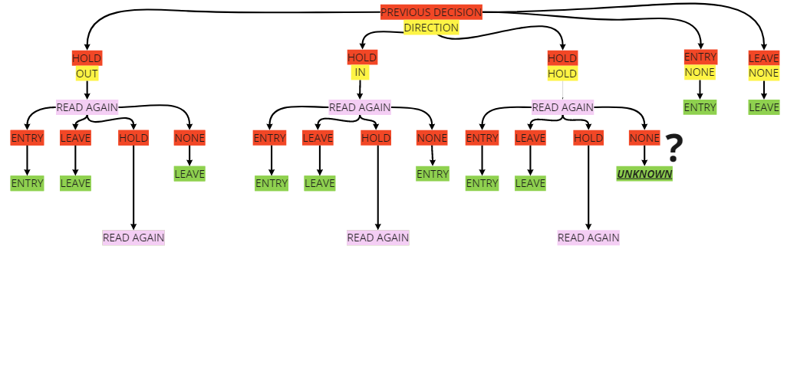
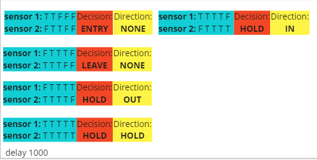

# Simple Arduino Room Occupancy Detector

A room occupancy detector system using several Arduino UNO, Bluetooth and Ultrasonic sensors.

## Purpose of the system

To track, in real time, the occupancy state of each room in a household or office that contains 3 rooms. (can also be used for bathroom stalls or whatever similar application)

## Components

- 4x Arduino UNO

- 6x Ultrasonic Sensors HC-SR04 ((# of arduinos -1) * 2) 

- 4x Arduino Bluetooth modules

- As many jumper wires as this takes

- A screen of size at least 20x4 to display the occupancy states

## System Design
TODO - Add System Design Image
<Image Placeholder>

## Placement of Components
TODO - Add Components placement Images
<Image Placeholder>

## How to detect Occupancy?

(Note that below - slave refers to "Bluetooth Slave device". Please don't cancel me.)

Jokes aside, this is perhaps the most difficult and enjoyable aspect of the project. We chose to use entry and exit sensors, whose state would then be used to increment or decrement a counter for each room. 

However,This method had issues since there would be so many different situations where it would be necessary to make decisions that would require great sensitivity and several historical checks. (See below for shallow examples)

The decisions to be made will either be (ENTRY-LEAVE-HOLD-NONE)

### How to use the images below:

- <mark>RED</mark>: Previous saved decision

- YELLOW: Direction

- PINK: Require another detection pass

- GREEN: Final decision

1. Every slave Arduino starts by calibrating its ultrasonic sensor to the normal distance it would read if there were no detection (was around 210cm in our case)

2. Every slave would then read every 200ms a new state.

3. Once any of the ultrasonic sensors would return a reading that indicates that an object higher than 150cm is within area of detection, it starts reading 4 more readings at 200ms intervals (stored as Historical data)

4. At the end of that reading, the slave Arduinos would compute the decision that is either (ENTRY - LEAVE - HOLD) by finding out where the object was last detected:
   
   1. ***ENTRY*** means that it has been concluded that an object qualifying as a human has entered the room
   
   2. ***LEAVE*** means that it has been concluded that an object qualifying as a human has left the room.
   
   3. ***HOLD*** means that an object is within detection range at the end of the detection period (total of 1 second) and another detection period is needed
      
      1. In this case we also store what the tendency of direction for the object in detection range was. 
         
         1. If it was last detected by sensor 1, we store hold + leave (case 1)
         
         2. If it was last detected by sensor 2, we store hold + entry (case 2)
         
         3. Otherwise, that means the object is within detection range of both sensors, we store hold + hold (case 3)
      
      2. After another detection period (steps 3-4), the slave arduinos would look into the new historical data and take a new decision. The decisions are the same as above, except if the previous decision is the following:
         
         1. ***HOLD + LEAVE + NO DETECTION*** --> LEAVE
         
         2. ***HOLD + ENTRY + NO DETECTION*** --> ENTRY
         
         3. ***HOLD + ENTRY + NO DETECTION*** --> UNKNOWN (no decision taken. Display an error msg and continue working normally)

5. Decisions, once computed, are sent to the master Arduino that keeps track of the current occupancy state of each room
